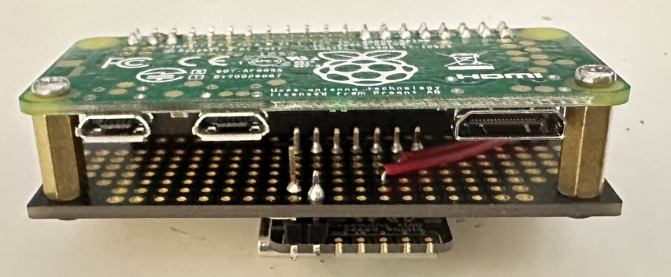
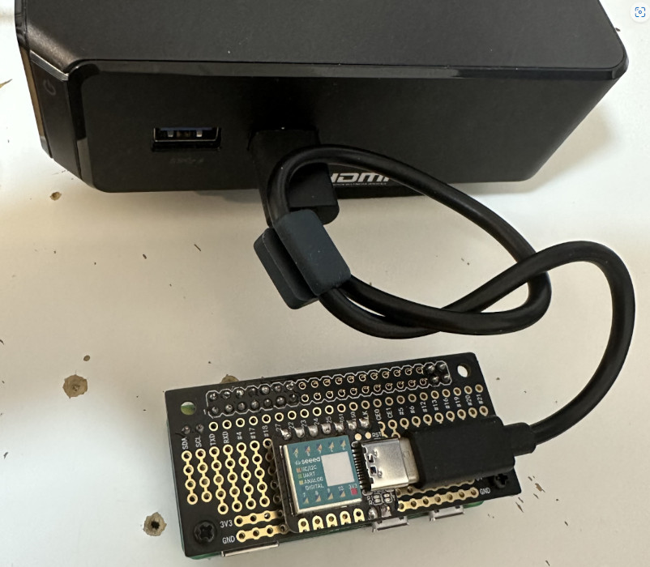
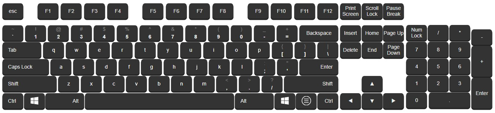

### Intro
* I want control my parent's computer via the internet so I can re-install MS Windows for them.
* They do not have an IPMI-enabled motherboard, so I need to make a remotely controlled gadget that emulates the keyboard and mouse.
* I have tested this gadget and used it in a Linux OS installation.
### The Gadget 
<table>
  <tr>
    <th style="width:350px">A Seeed Studio Xiao (SAMD21) and Raspberry Pi Zero Wireless (Pi ZW) couple.</th>
    <th>My parents' PC will power the couple.</th> 
  </tr>
  <tr>
    <td></img></td>
    <td></img></td> 
  </tr>
  <tr>
    <th colspan=2>The couple is controlled via a virtual keyboard webpage.</th> 
  </tr>
  <tr>
    <td colspan=2></img></td> 
  </tr> 
</table>

### Features
* Hardware-based, no need to install software on a remote machine.
* Can be used to install operating system.
* Control the remote machine from a web browser.
* Communication is SSL encrypted and basic authentication is required.
### Mechanism
* My parents' PC powers the couple through a cable connected to Xiao (Pi is powered by Xiao through the 5V Pin).
* I control the Pi through a virtual keyboard webpage, Pi controls the Xiao via I2C protocol, and Xiao emulates an HID combo of keyboard and mouse.
* A websocket server is establised to broadcast keystrokes collected from the web browser (one websocket client) to the Pi (another websocket client).
### Usage
* Flash [remoteKM.ino](remoteKM.ino) to Xiao.
```
arduino-cli core update-index               --additional-urls https://files.seeedstudio.com/arduino/package_seeeduino_boards_index.json
arduino-cli core install seeeduino:samd     --additional-urls https://files.seeedstudio.com/arduino/package_seeeduino_boards_index.json
arduino-cli lib install Keyboard
arduino-cli lib install Mouse
arduino-cli compile . --fqbn   Seeeduino:samd:seeed_XIAO_m0 && arduino-cli upload . --fqbn   Seeeduino:samd:seeed_XIAO_m0 -p /dev/ttyACM0
```
* Wire the Xiao to Pi, run [client.ipynb](client.ipynb) on Pi, run [server.ipynb](server.ipynb) somewhere, open the [keyboard.html](keyboard.html) in a web browser.
### Misc
* Find Keyboard Map @ ~/Arduino/libraries/Keyboard/src/[Keyboard.h](misc/Keyboard.h)
* Find Mouse    Map @ ~/Arduino/libraries/Mouse/src/[Mouse.h](misc/Mouse.h)