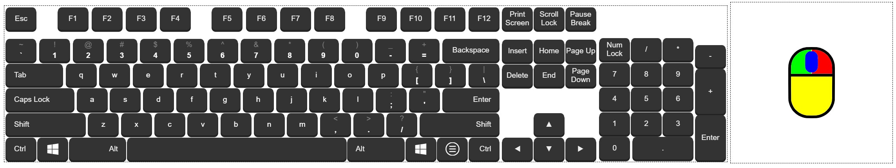

### Keyboard and Mouse Simulation
* I want control my parent's computer via the internet so I can re-install MS Windows for them. 
* They do not have an IPMI-enabled motherboard, so I need to create a keyboard-mouse-over-ip device for them.
### Features
* Hardware-based, no need to install software on a remote machine.
* Control the remote machine from a web browser 
* Can be used to install operating system.
* SSL encrypted communication and Basic authentication 
### The Gadget
* I coupled a Seeed Studio Xiao (SAMD21) to a Raspberry Pi Zero Wireless (Pi ZW). 
</img> 
</img>
* The couple is controlled via a virtual keyboard webpage. 
</img>

### Mechanism
* My parents' PC powers the couple through a cable connected to Xiao (Pi is powered by Xiao through the 5V Pin).
* A websocket server is establised to forward the keystroke from the web browser (a websocket client) to the Pi (another websocket client).
* Both Pi and virtual keyboard connect to the websocket server, which is a keystroke broadcaster.
* The Pi ZW receives the keystroke and sends it to Xiao via I2C.
* The Xiao emulates an HID Keyboard and an HID Mouse.
### Usage
Flash [remoteKM.ino](remoteKM.ino) to Xiao, wire the Xiao to Pi, run [client.ipynb](client.ipynb) (a websocket client) on Pi, run [server.ipynb](server.ipynb) (the websocket server) , open the [keyboard.html](keyboard.html) (another websocket client) in a web browser.
### Misc
* Find Keyboard Map @ ~/Arduino/libraries/Keyboard/src/Keyboard.h 
* Find Mouse    Map @ ~/Arduino/libraries/Mouse/src/Mouse.h 